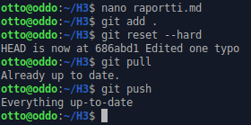
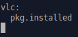
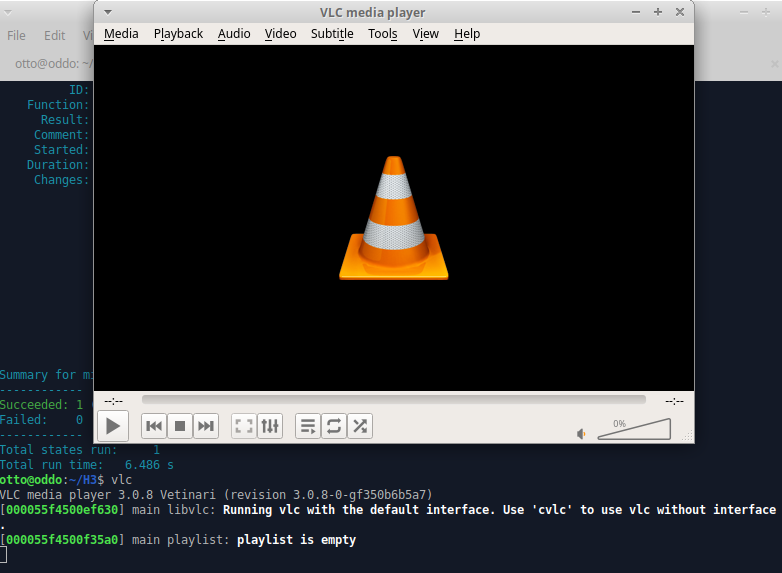

# Palvelinten hallinta - h3

## a) Tee tämän tehtävän raportti MarkDownina. Helpointa on tehdä raportti GitHub-varastoon, jolloin md-päätteiset tiedostot muotoillaan automaattisesti. Tyhjä rivi tekee kappalejaon, risuaita '#' tekee otsikon, sisennys merkitsee koodinpätkän.

Aloitin asentamalla koneelle gitin komennoilla

> sudo apt-get update

> sudo apt-get install -y git

Ja laitettuani asennuksen päällä siirryin selaimella githubiin ja tein uuden repositorion nimeltä "H3".
Kloonasin repositorion komennolla

> git clone https://github.com/toivanenotto/H3.git

Siirryin kloonaamaani H3-kansioon ja aloin kirjoittamaan tätä raporttia MarkDownina.

## d) Näytä omalla git-varastollasi esimerkit komennoista 'git log', 'git diff' ja 'git blame'. Selitä tulokset.

Aloitin komennolla

> git log

Komento näyttää repositorion muutokset, niiden tekijät ja tarkan kellonajan.

> git diff

Komento näyttää erot kahden eri version välillä.

> git blame

Komento näyttää tiedostojen rivien muokkausajat ja tekijän.

## e) Tee tyhmä muutos gittiin, älä tee commit:tia. Tuhoa huonot muutokset 'git reset --hard'. Huomaa, että tässä toiminnossa ei ole peruutusnappia.

Lisäsin tähän raporttiin pätkän tekstiä

Ja sitten tein tehtävänannossa mainitus komennon

> git reset --hard

Jolloin palautui viimeisin versio jolle oltiin tehty commit.

## f) Tee uusi salt-moduli. Voit asentaa ja konfiguroida minkä vain uuden ohjelman: demonin, työpöytäohjelman tai komentokehoitteesta toimivan ohjelman. Käytä tarvittaessa 'find -printf "%T+ %p\n"|sort' löytääksesi uudet asetustiedostot. (Tietysti eri ohjelma kuin aiemmissa tehtävissä, tarkoitushan on harjoitella Salttia)

Päätin tehdä VLC-modulin joka asentaa kyseisen ohjelman.

Aloitin tekemällä kansion modulia varten

> sudo mkdir /srv/salt/vlc

Ja tekemällä sinne init.sls-tiedoston

Ja sen jälkeen ajoin modulin

> sudo salt '*' state.apply vlc

Kokeiluksi avasin VLC:n kirjoittamalla komentoriville vlc

Ja homma toimi.
